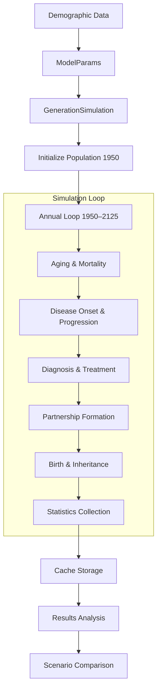
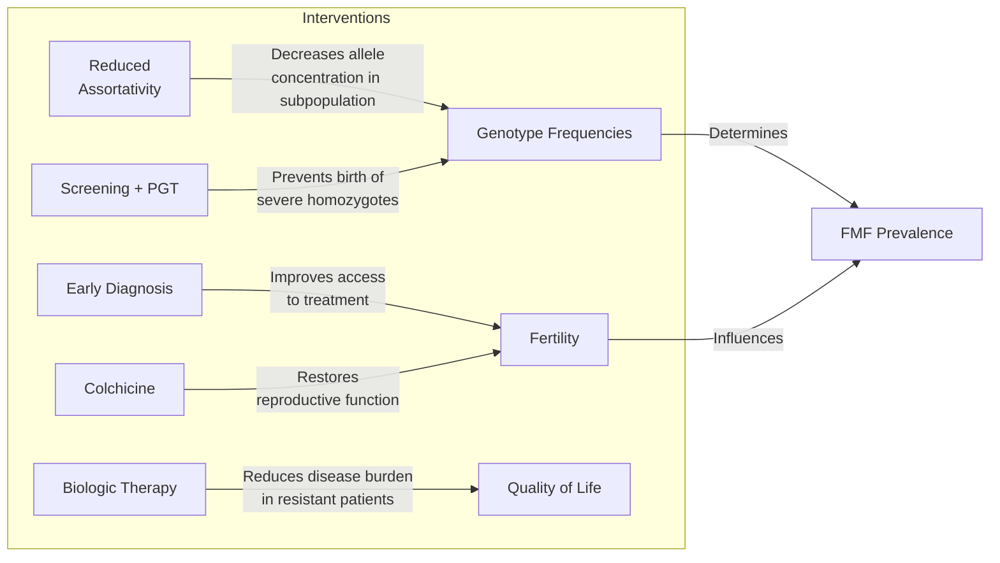

# FMF Population Simulation Model

**Agent-based simulation model for studying Familial Mediterranean Fever (FMF) epidemiology, genetic inheritance, screening strategies, and therapeutic interventions (1950-2125)**

##  Overview

This project implements an agent-based model (ABM) to simulate the population dynamics of Familial Mediterranean Fever (FMF) from 1950 to 2125. The model integrates demographic dynamics, genetic inheritance, disease progression, and healthcare interventions to evaluate the effectiveness of various public health strategies in the Armenian population.

### What is FMF?
Familial Mediterranean Fever (FMF) is an autoinflammatory disease characterized by recurrent episodes of fever and serositis. The disease is particularly prevalent among Armenian, Turkish, Arab, and Jewish populations. It is caused by mutations in the MEFV gene, with M694V being the most common pathogenic variant among Armenian patients (frequency ~4.37%).

### Research Questions Addressed
- How do different genetic screening strategies affect FMF prevalence?
- What is the impact of Preimplantation Genetic Testing (PGT) on reducing disease burden?
- How does assortative mating influence allele frequency in the population?
- What is the cost-effectiveness of different intervention strategies?
- How does fertility recovery through treatment affect population dynamics?

##  Key Features

### Core Capabilities
- **Agent-based modeling**: 5,000-20,000 individual agents with unique genetic, demographic, and clinical profiles
- **Population genetics**: Tracks MEFV mutations (M694V, V726A, M680I, R761H) with Mendelian inheritance
- **Demographic realism**: Uses historical demographic data for Armenia (1950-2125)
- **Clinical pathways**: Realistic disease onset (age-dependent), severity assessment (mild/moderate/severe), diagnosis, and treatment
- **Family structures**: Tracks parent-child relationships, partnerships, and genetic inheritance
- **Calibration framework**: Validates against published epidemiological data

### Modeled Interventions
| Intervention | Description | Implementation |
|--------------|-------------|----------------|
| **Population Screening** | Universal genetic screening | Configurable coverage (0-100%) and efficiency |
| **PGT** | Preimplantation Genetic Testing | Available from 2018, 85% efficiency |
| **Assortative Mating** | Endogamy/exogamy patterns | Targets 85% → 55% endogamy |
| **Colchicine Therapy** | Baseline treatment | Restores fertility (50-95%) |
| **IL-1 Inhibitors** | Biologics for resistant cases | Available in Scenario 3 |
| **Systemic Diagnosis** | Clinical diagnosis system | Age-dependent access, severity modifiers |

### Analysis Tools
- **Monte Carlo ensemble**: Multiple independent runs with parallel execution
- **Scenario comparison**: Automatic comparison with publication-quality visualizations
- **Validation framework**: Calibration with 95% confidence intervals
- **Intelligent caching**: Reduces computation time for repeated runs
- **Comprehensive reporting**: 10+ detailed text reports and Excel exports


### Project Structure

```text
fmf-simulation/
├── Agent.py                       # Agent class managing individual lifecycle, genetics, and clinical state
├── ModelParams.py                 # Configuration parameters and scenario definitions
├── GenerationSimulation.py        # Core simulation engine executing demographic and genetic steps
├── run_optimized.py              # Optimized runner with caching and performance enhancements
├── main.py                       # Main orchestration script running all scenarios and comparisons
├── caches.py                     # Global cache management module
├── requirements.txt              # Project dependencies
│
├── data/                         # Demographic datasets and projections (1950–2125)
│   ├── birth_rate_full_1950_2125.csv       # Crude birth rate series
│   ├── death_rate_full_1950_2125.csv       # Age-specific mortality tables
│   ├── fertility_rate_full_1950_2125.csv   # Total fertility rates
│   ├── age_structure_1950.csv             # Baseline population age distribution (1950)
│   └── age_fertility_dist.csv            # Age-specific fertility distributions
│
├── scenario_1/                   # Output data and metrics for Scenario 1 (Baseline)
├── scenario_2/                   # Output data and metrics for Scenario 2 (Screening/Intervention)
├── scenario_3/                   # Output data and metrics for Scenario 3 (Alternative Therapy)
└── comparison_results/           # Comparative analysis graphs, plots, and summary statistics

```
### Data Flow Diagram




## Requirements

```text
numpy>=1.19.0          # Numerical computations
pandas>=1.2.0          # Data manipulation
matplotlib>=3.3.0      # Plotting
seaborn>=0.11.0        # Statistical visualizations
scipy>=1.7.0           # Scientific computing
tqdm>=4.60.0           # Progress bars
rich>=10.0.0           # Rich console output
psutil>=5.8.0          # System monitoring
openpyxl>=3.0.0        # Excel output
```

## Quick Start

#### Run all three scenarios with automatic comparison
python main.py

This will:

1. Run all three scenarios in parallel (Monte Carlo ensemble)

2. Generate comprehensive statistical reports

3. Create comparison plots

4. Save all outputs in organized folders

## Usage Guide

### Running All Scenarios
python main.py

1. The main script will:
2. Load demographic data
3. Run Scenario 1 (Status Quo)
4. Run Scenario 2 (Population Screening)
5. Run Scenario 3 (Screening + PGT)
6. Generate comparison plots
7. Create summary reports

### Single Simulation

```python
import pandas as pd
from GenerationSimulation import GenerationSimulation
from ModelParams import ModelParams
from main import load_demographic_data

# Load demographic data
birth_rate, death_rate, tfr, age_structure, fert_factors = load_demographic_data()

# Initialize parameters for Scenario 1
params = ModelParams.scenario_1()

# Create simulation instance
sim = GenerationSimulation(
    params=params,
    birth_rate_df=birth_rate,
    death_rate_df=death_rate,
    fertility_rate_df=tfr,
    age_structure_df=age_structure,
    fertility_factors_df=fert_factors
)

# Run simulation (1950–2125)
results = sim.run_simulation_with_calibration(verbose=True)

# Generate and print summary reports
sim.print_population_stats("Scenario_1")
sim.print_fertility_report()
sim.print_allele_report()
sim._print_detailed_inheritance_stats()

# Export simulation results to CSV
df = pd.DataFrame(results)
df.to_csv("simulation_results.csv", index=False)

```

### Monte Carlo Ensemble

```python
from run_optimized import run_single_simulation_optimized
from main import load_demographic_data, run_multiple_simulations

# Load data
birth_rate, death_rate, tfr, age_structure, fert_factors = load_demographic_data()
data_files = (birth_rate, death_rate, tfr, age_structure, fert_factors)

# Run multiple simulations in parallel
results = run_multiple_simulations(
    params=model_params,
    data_files=data_files,
    parallel=True,                      # Multi-core processing
    show_progress=True,                 # Progress bar
    years_to_keep=list(range(1950, 2126))
)

# Results are automatically saved to CSV
df = pd.DataFrame(results)
df.to_csv("monte_carlo_all_runs.csv", index=False)
```

### Scenario Comparison

```python
from main import compare_scenarios, compare_all_scenarios_together

# Compare two scenarios
compare_scenarios(
    file1="scenario_1/yearly_median_1950_2125.csv",
    file2="scenario_2/yearly_median_1950_2125.csv",
    output_dir="comparison_results_sc1_sc2",
    name1="S1: Status Quo",
    name2="S2: Screening (2010)",
    bifurcation_year=2010
)

# Compare all three scenarios
scenario_files = {
    'S1': "scenario_1/yearly_median_1950_2125.csv",
    'S2': "scenario_2/yearly_median_1950_2125.csv",
    'S3': "scenario_3/yearly_median_1950_2125.csv"
}

compare_all_scenarios_together(
    scenario_files_dict=scenario_files,
    output_dir="comparison_all_scenarios"
)
```

### Cache Management

```python
from run_optimized import clear_simulation_cache, get_cache_stats

# Clear all cached simulations
clear_simulation_cache(verbose=True)

# Get cache statistics
stats = get_cache_stats()
print(f"Cache size: {stats['size']}/{stats['max_size']}")
print(f"Cache version: {stats['version']}")
```

### Scenarios

Scenario 1: Status Quo
Baseline - No interventions, natural population dynamics (1950-2125)

```python
ModelParams.scenario_1()
```

### Baseline Scenario Configuration (Scenario 1)

**Purpose:** Serves as the baseline control for evaluating intervention effectiveness across comparative runs.

| Parameter | Value | Description |
| :--- | :--- | :--- |
| **Assortative Mating** | `0.85` | High endogamy rate within the population (85%) |
| **Screening** | `Disabled` | No population-wide genetic screening implemented |
| **PGT** | `Disabled` | Preimplantation genetic testing disabled |
| **Fertility Recovery** | `0.50` | Moderate fertility restoration under treatment |
| **Ethnic Distribution** | `90% / 10%` | Historical distribution (90% Armenian, 10% Other) |
| **Diagnosis** | `Enabled` | Systemic clinical diagnosis available from 1990 onwards |
| **Biologics Access** | `0.00` | No access to biologic therapies (anti-IL-1) |

### Scenario 2: Population Screening

Screening - Universal genetic screening from 2010

```python
ModelParams.scenario_2()
```
### Intervention Scenario Configuration (Scenario 2)

**Purpose:** Evaluate population screening effectiveness and the impact of moderate genetic testing interventions.

| Parameter | Value | Description |
| :--- | :--- | :--- |
| **Assortative Mating** | `0.75` | Decreased endogamy within the population |
| **Screening** | `Enabled (60%)` | Population screening implemented with 60% coverage |
| **Screening Efficiency** | `0.30` | 30% of screened individuals take preventive action |
| **PGT** | `Enabled (50%)` | Preimplantation genetic testing available with limited (50%) efficiency |
| **Fertility Recovery** | `0.85` | Good fertility restoration under colchicine treatment |
| **Ethnic Distribution** | `80% / 20%` | Increased population admixture (80% Armenian, 20% Other) |
| **Biologics Access** | `0.05` | Limited access to biologic therapies (anti-IL-1) |

### Scenario 3: Screening + PGT

Maximum Intervention - Screening plus PGT from 2018

```python
ModelParams.scenario_3()
```

### Maximum Intervention Scenario Configuration (Scenario 3)

**Purpose:** Maximum intervention impact assessment evaluating high-efficiency screening, PGT adoption, and expanded treatment access.

| Parameter | Value | Description |
| :--- | :--- | :--- |
| **Assortative Mating** | `0.55` | Significantly reduced endogamy |
| **Screening** | `Enabled (80%)` | Mass population screening with 80% coverage |
| **Screening Efficiency** | `0.80` | 80% of screened individuals take preventive action |
| **PGT** | `Enabled (85%)` | High PGT availability with 85% efficiency |
| **PGT Start Year** | `2018` | PGT available from 2018 onwards |
| **Fertility Recovery** | `0.95` | Near-complete fertility restoration under treatment |
| **Ethnic Distribution** | `60% / 40%` | High population admixture (60% Armenian, 40% Other) |
| **Biologics Access** | `0.15` | Expanded access to biologic therapies (anti-IL-1) |


### Model Components

### `Agent` Class Overview

The `Agent` class represents an individual entity within the simulation, tracking full lifecycle dynamics, genetic background, clinical progression, and familial connections.

#### Key Attributes

| Category | Attribute | Description |
| :--- | :--- | :--- |
| **Demographic** | `age` | Current age of the individual |
| | `gender` | Biological sex |
| | `ethnicity` | Ethnic background/subpopulation classification |
| | `generation` | Generational index within the cohort |
| | `birth_year` | Year of simulated birth |
| **Genetic** | `mefv_allele_1` | First *MEFV* allele variant |
| | `mefv_allele_2` | Second *MEFV* allele variant |
| | `genotype_status` | Genotype classification (e.g., homozygous, heterozygous) |
| | `mutation_type` | Specific mutation severity/combination profile |
| **Clinical** | `clinical_status` | Current disease state (e.g., asymptomatic, active FMF, amyloidosis) |
| | `disease_severity` | Quantified clinical severity score |
| | `age_of_onset` | Age at symptom onset |
| | `is_diagnosed` | Boolean indicator of formal clinical diagnosis |
| **Treatment** | `on_colchicine` | Active colchicine therapy status |
| | `is_colchicine_resistant` | Indicator of treatment resistance |
| | `on_antibodies` | Active biologic/anti-IL-1 therapy status |
| **Screening** | `is_screened` | Screening program participation status |
| **Family** | `father_id` | Unique identifier for paternal link |
| | `mother_id` | Unique identifier for maternal link |
| | `partner_id` | Unique identifier for active partner |
| | `children_ids` | List of offspring unique identifiers |
| **Reproductive** | `last_birth_year` | Year of most recent offspring birth |


#### Key Methods:

```python
# Set genotype with parent tracking
agent.set_genotype(allele_1, allele_2)

# One year of agent life
agent.age_year(annual_death_prob, current_year)

# Check fertility eligibility
agent.can_get_pregnant(current_year, birth_cooldown)

# Update genotype status from alleles
agent.update_genotype_status()
```

### `GenerationSimulation` Class Overview

The `GenerationSimulation` class serves as the core engine responsible for managing population-wide processes, running yearly cycles, and executing diagnostic, screening, and reporting pipelines.

#### Core Execution & Reporting API

```python
# Execute main simulation loop (1950–2125)
sim.run_simulation_with_calibration(verbose=True)

# Generate demographic and clinical summary metrics
sim.print_population_stats("Scenario_1")

# Analyze fertility trends across generations
sim.print_fertility_report()

# Track allele frequency dynamics over time
sim.print_allele_report()

# Evaluate population screening outcomes (Scenarios 2–3)
sim.print_screening_report()

# Generate detailed PGT usage and success reports (Scenario 3)
sim.print_pgt_detailed_report()

# Verify Mendelian inheritance accuracy
sim._print_detailed_inheritance_stats()

# Export yearly time-series data for analysis
yearly_stats = sim.collect_all_yearly_stats(run_id)

```

### ModelParams Class

Configuration parameters for all scenarios.

```python
@dataclass
class ModelParams:
    # Population
    initial_population_size: int = 5000
    max_age_limit: int = 85
    num_runs: int = 2
    
    # Mating
    ethnic_assortativity: float
    ethnic_distribution: dict
    
    # Screening
    use_screening: bool
    screening_coverage: float
    screening_efficiency: float
    screening_start_year: int = 2010
    
    # PGT
    use_pgt: bool
    pgt_efficiency: float
    pgt_start_year: int = 2018
    
    # Fertility
    fertility_recovery: float
    
    # Diagnosis
    do_diagnosing: bool
    systemic_diagnosis_start_year: int = 1990
    diagnosis_slope: float = 0.012350
    diagnosis_intercept: float = -24.52535
    diagnosis_min_prob: float = 0.05
    diagnosis_max_prob: float = 0.98
    diagnosis_child_multiplier: float = 1.3
    diagnosis_adult_multiplier: float = 0.8
    
    # Treatment
    bio_access_pgt_scenario: float = 0.15
    bio_access_screening_scenario: float = 0.05
    bio_access_baseline: float = 0.0
```

### Output Files

Per Scenario Folder
### Output Files Directory Structure

Each scenario directory contains the following generated output files and analytical reports:

| File Name | Description | Format |
| :--- | :--- | :--- |
| **`monte_carlo_all_runs.csv`** | Raw simulation time-series data covering all simulated years and Monte Carlo runs | CSV |
| **`monte_carlo_summary.csv`** | Aggregated summary statistics with confidence intervals (CIs) across runs | CSV |
| **`yearly_median_1950_2125.csv`** | Annual median trajectories accompanied by 95% confidence intervals | CSV |
| **`yearly_analysis_summary.txt`** | Detailed text-based report summarizing longitudinal population trends | TXT |
| **`calibration_check.txt`** | Diagnostic log evaluating genotype distribution and model calibration status | TXT |
| **`allele_report_calibration.txt`** | Quantitative analysis of *MEFV* allele frequency calibration over time | TXT |
| **`final_report_detailed.txt`** | Comprehensive final summary report covering demography and epidemiology | TXT |
| **`fertility_impact.txt`** | Dedicated analysis of disease- and treatment-driven fertility metrics | TXT |
| **`report_Scenario_YYYY.xlsx`** | Full agent-level data snapshot exported at specified key benchmark years | Excel |
| **`screening_efficiency.txt`** | Performance and coverage metrics for population screening *(Scenarios 2–3)* | TXT |
| **`biologics_report.txt`** | Clinical outcomes and utilization metrics for anti-IL-1 therapy *(Scenario 3)* | TXT |
| **`pgt_detailed_report.txt`** | Comprehensive analysis of preimplantation genetic testing adoption and efficacy *(Scenario 3)* | TXT |


### Comparison Results

```text
comparison_all_scenarios/
├── all_scenarios_prevalence_total_pct.png
├── all_scenarios_m694v_homo_in_affected_pct.png
├── all_scenarios_m694v_homo_absolute.png
├── all_scenarios_compound_in_affected_pct.png
├── all_scenarios_hetero_in_affected_pct.png
├── all_scenarios_other_homo_in_affected_pct.png
├── all_scenarios_prevented_cases.png
├── all_scenarios_prevalence_with_zones.png
└── all_scenarios_m694v_homo_prevalence_pct.png
```

### Model Validation

#### Calibration Targets

The model is calibrated against published epidemiological data:

```python
target_values = {
    'm694v_homo_in_affected_pct': 11.12,    # M694V homozygotes among patients
    'compound_in_affected_pct': 58.26,      # Compound heterozygotes among patients
    'hetero_in_affected_pct': 25.33,        # Simple heterozygotes among patients
    'other_homo_in_affected_pct': 2.00,     # Other homozygotes among patients
    'late_onset_pct': 3.40,                 # Late onset cases
    'prevalence_total_pct': 0.51            # Total prevalence in population
}
```

### Validation Metrics

* Genetic distribution: Compares genotype proportions with clinical studies (95% CIs)

* Disease prevalence: Validates against known epidemiological data

* Demographic dynamics: Confirms population growth rates (RMSE < 3.0)

* Clinical outcomes: Checks diagnosis and treatment patterns

* Mendelian inheritance: Verifies genetic transmission patterns

### Validation Output Example

### Baseline Population Validation (1950)

**Sample Details:** $N = 100$ iterations | Average sample size: 19,987.5 individuals

| Parameter | Mean % (± Std) | Target % | Error | Status |
| :--- | :--- | :--- | :--- | :--- |
| **Armenian Subpopulation** | 90.12% (±0.45) | 90.00% | +0.12% | MATCH |
| **Other Subpopulation** | 9.88% (±0.45) | 10.00% | -0.12% | MATCH |
| **Endogamy Rate** | 84.95% (±0.32) | 85.00% | -0.05% | MATCH |
| **Exogamy Rate** | 15.05% (±0.32) | 15.00% | +0.05% | MATCH |
| **FMF Carrier Prevalence** | 8.71% (±0.22) | — | — | Baseline |
| **M694V Allele Frequency** | 4.37% (±0.15) | — | — | Baseline |

### Results Visualization

Generated Plots
1. Prevalence Trends

- Population-wide disease prevalence (1950-2125)

- 95% confidence intervals

- Intervention zones highlighted

2. Genotype Distribution

- M694V allele frequency over time

- Genotype proportions among patients

- Absolute counts of mutation carriers

3. Intervention Impact

- Before/after comparison of interventions

- Prevented cases (cumulative)

- Diagnosis rates over time

4. Treatment Coverage

- Colchicine therapy rates

- Biologic therapy for resistant cases

- Screening coverage validation

5. Three-Scenario Comparison

- All metrics compared across scenarios

- Intervention start years marked

- Statistical significance indicated

### Plot Customization

```python
# All plots are generated with:
- Line plots with rolling averages (window=5-10 years)
- Confidence intervals (95%)
- Intervention zones with shaded regions
- Publication-quality styling (seaborn)
- High resolution (300 DPI)
- Scientific color palette
```

### Performance Optimization

#### Caching System

The simulation includes an intelligent caching system to reduce computation time:

```python
from run_optimized import run_single_simulation_optimized, clear_simulation_cache

# Run with caching (enabled by default)
result = run_single_simulation_optimized(
    run_id=1,
    params=params,
    birth_rate_df=birth_rate,
    death_rate_df=death_rate,
    tfr_df=tfr,
    age_structure_df=age_structure,
    fertility_factors_df=fert_factors,
    use_cache=True,          # Use cached results if available
    force_recompute=False    # Don't force recomputation
)

# Cache features:
- Max 128 cached simulations
- Version control (_CACHE_VERSION)
- Automatic LRU eviction
- Thread-safe with locks
- 32-bit hash keys
```

### Parallel Execution

```python
# Monte Carlo ensemble runs in parallel
# Number of workers = CPU cores - 1
# Progress bar shows completion status
# Each run has unique random seed
```

### Memory Management

1. Agent storage: Efficient dictionaries 
2. Data frames: Optimized pandas operations 
3. Numpy vectorization: Fast statistical calculations 
4. Garbage collection: Automatic cleanup

### Parameter Tuning

#### Key Parameters for Sensitivity Analysis

```python
# Population parameters
params.initial_population_size = 20000   # 5000-50000
params.max_age_limit = 85                # 80-100

# Screening parameters
params.screening_coverage = 0.50         # 0.0 - 1.0
params.screening_efficiency = 0.95       # 0.0 - 1.0
params.screening_start_year = 2010       # 2000-2020

# PGT parameters
params.pgt_efficiency = 0.80             # 0.0 - 1.0
params.pgt_start_year = 2018             # 2010-2025

# Fertility parameters
params.fertility_recovery = 0.70         # 0.0 - 1.0

# Mating parameters
params.ethnic_assortativity = 0.75       # 0.0 - 1.0
params.ethnic_distribution = {
    'Armenian': 0.80,
    'Other': 0.20
}

# Diagnosis parameters
params.diagnosis_slope = 0.012350
params.diagnosis_intercept = -24.52535
params.diagnosis_min_prob = 0.05
params.diagnosis_max_prob = 0.98
```

## How It Works

This section explains the "why" and "how" behind the model, enabling researchers and clinicians without a technical background to understand its internal logic and underlying assumptions.

### 1. Why Agent-Based Modeling?

FMF is not simply an infection spreading through a population. It is a genetic disease influenced by:
- **Mendelian inheritance** (transmission of alleles from parents to offspring);
- **Assortative mating** (endo- and exogamy within ethnic groups);
- **Reproductive behavior** (changes in fertility due to disease or treatment);
- **Medical interventions** (screening, PGT, therapy) that affect reproductive decisions.

Compartmental model equations (SIR and their analogs) struggle to capture pedigrees and individual reproductive decisions. An agent-based model (ABM) allows us to track **each individual, their genes, and their family connections** across many generations.

### 2. Core Model Assumptions

Before reading the logic description, it is important to understand the key simplifications embedded in the model:

| Assumption | Rationale |
| :--- | :--- |
| **Closed population** | No migration. Changes in ethnic composition are modeled through the exogamy parameter rather than immigration/emigration. |
| **Penetrance is an age-dependent function** | The probability of developing symptoms in a mutation carrier increases with age, reaching a plateau. This reflects the clinical reality of FMF. |
| **Fertility is restored by treatment** | Untreated FMF reduces fertility due to systemic inflammation and amyloidosis. Colchicine partially restores it. This effect is parameterized. |
| **The decision to use PGT is made consciously** | In the model, couples who have undergone screening and are aware of their carrier status decide to undergo PGT with probability `screening_efficiency`. |
| **No spontaneous mutations** | The *de novo* mutation rate for *MEFV* is extremely low; therefore, the model considers only inherited variants. |

### 3. Agent Lifecycle (Year-by-Year Logic)

The simulation proceeds in discrete 1-year steps. For each agent in the population, the following stages are executed annually in strict order:

#### Stage 1: Aging and Mortality
- The agent's age increases by 1.
- Based on age and sex, the annual probability of death is extracted from the `death_rate_df` tables.
- With probability `p = annual_death_prob`, the agent dies. Deceased agents are removed from the population.
- Agents reaching `max_age_limit` (default: 85 years) are removed mandatorily.

#### Stage 2: Disease Onset (Penetrance)
- If the agent carries pathogenic *MEFV* mutations and has not yet manifested symptoms, penetrance is evaluated.
- FMF penetrance is incomplete and age-dependent. The model uses cumulative probability: for each year of the agent's life, there is a probability `p_onset(age)` that the disease will first manifest at that specific age.
- Upon penetrance, `age_of_onset` is recorded, and the agent transitions to the "symptomatic" state.
- Carriers of two severe mutations (e.g., M694V/M694V) have a significantly higher cumulative penetrance and an earlier mean age of onset.


#### Stage 3: Diagnosis
- Symptomatic agents may receive a diagnosis. The probability of diagnosis is calculated using a **logistic model**:

  `P(diagnosis) = logistic(slope * year + intercept + age_modifier + severity_modifier)`

- **Before `systemic_diagnosis_start_year` (1990)**, diagnosis is extremely difficult (low baseline probability).
- **After 1990**, the probability of diagnosis increases each year, reflecting improvements in physician awareness and the availability of genetic testing.
- Children (especially those with a positive family history) have elevated chances of early diagnosis (`diagnosis_child_multiplier = 1.3`).

#### Stage 4: Treatment and Therapeutic Response
- Diagnosed agents initiate colchicine therapy (the standard of care for FMF).
- The model evaluates colchicine response:
    - **Responders:** Achieve symptom control, quality of life improves, and fertility is restored to the level specified by `fertility_recovery` (ranging from 0.5 to 0.95, depending on the scenario).
    - **Resistant (≈5-10%):** Do not respond to colchicine. For these agents in Scenario 3, anti-IL-1 therapy (biologic treatment) is available with probability `bio_access_pgt_scenario`.
- Treatment efficacy directly influences the agent's fertility in the next stage.

#### Stage 5: Partnership Formation and Fertility
- **Partnerships:** Female agents of reproductive age (accounting for `last_birth_year` and `birth_cooldown`) search for a male partner.
- **Assortativity:** With probability `ethnic_assortativity`, the partner is chosen from the same ethnic group (Armenian/Armenian). This is the key parameter for modeling endogamy, which maintains the high M694V allele frequency in the Armenian population.
- **Conception:** The probability of conception for a partnered female is determined by age-specific fertility rates from `fertility_factors_df`, multiplied by the agent's fertility modifier:
    - `1.0` for healthy women.
    - `<1.0` for untreated or colchicine-resistant FMF patients.
    - `fertility_recovery` for patients who have responded to therapy.

#### Stage 6: Offspring Birth and Inheritance
- Upon successful conception, a new agent (offspring) is created with a unique ID.
- **Mendelian inheritance:** The offspring receives one randomly selected allele from each parent. The paternal allele is chosen randomly from `{paternal_allele_1, paternal_allele_2}`, and the maternal allele from `{maternal_allele_1, maternal_allele_2}`.
- Based on the allele combination, `genotype_status` (Homozygous, Compound Heterozygous, Simple Heterozygous, WT) and predicted disease severity are determined.
- **PGT (if active):** If the scenario includes PGT, the couple is aware of the risk (both have undergone screening), and the condition `random < pgt_efficiency` is met, then:
    - The model "rejects" embryos with high-risk genotypes (e.g., M694V/M694V, compound heterozygotes with a severe prognosis).
    - The conception procedure is repeated (in the model, this is an instantaneous recalculation of the genotype until an acceptable one is obtained).
    - This directly reduces the birth of offspring with severe forms of FMF but may slightly reduce overall fertility (reflected in the scenario parameters).

### 4. Population Genetics Mechanism

#### Allele Frequencies and Drift
In a closed population without migration, allele frequencies change under the influence of:
1. **Genetic drift:** Random fluctuations in small populations (particularly at the simulation start with 5,000 agents).
2. **Selection (against homozygotes with severe forms):** Reduced fertility of untreated patients acts as negative selection against pathogenic alleles. Colchicine treatment **weakens this selection**, which is an important finding of the model.
3. **Assortative mating:** High endogamy concentrates alleles within the subpopulation.

#### Initialization (1950)
The model initializes the 1950 population with predefined genotype frequencies corresponding to the observed M694V allele frequency (≈4.37% in Armenians). The population is created "from scratch" without family ties but with the correct genotype distribution, which undergoes calibration against clinical data.

### 5. Calibration and Validation

#### Why Is Calibration Needed?
The model has numerous parameters (penetrance, fertility, diagnosis probabilities), many of which are known only approximately. Calibration ensures that:
- By 2020, the model reproduces the observed FMF prevalence (~0.5%).
- The genotype distribution among patients matches published clinical studies (target values from `target_values`).

#### How Is It Implemented?
After completing a simulation run, the `_check_calibration()` method is invoked, which:
1. Calculates the mean values of key metrics (e.g., % M694V homozygotes among patients) over the last N years.
2. Compares them with `target_values`, accounting for 95% confidence intervals.
3. Generates the `calibration_check.txt` report.
4. If parameters fall outside acceptable ranges, the Monte Carlo ensemble allows assessment of whether this is a systematic error or a statistical outlier.

### 6. Modeling Interventions: Causal Pathways

The model is designed to isolate the effect of each intervention:

